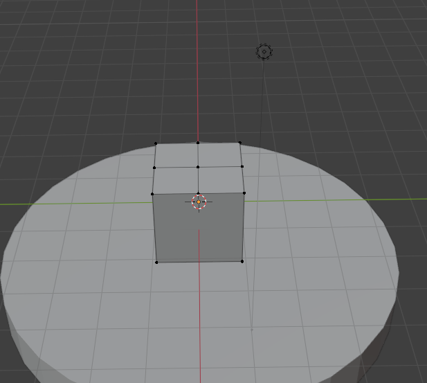
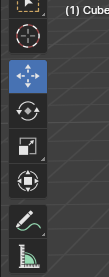

# Einführung

In diesem Tutorial wirst du die Basics von Blender kennenlernen. Das Endprodukt wird ein kleines Haus auf einer Wiese sein. Du wirst über 3D modelling, Modifikatoren, Shading und Rendering lernen.

## Start
Nachdem du Blender geöffnet hast, schau dich erst einmal um. Ich werde in diesem Tutorial einige Fachbegriffe nutzen, die ich wenn sie vorkommen noch einmal erklären werde. Hier aber nun ein kurzer Überblick:

---
- __Blender:__ Bekanntes 3D Modell Bearbeitungsprogramm
- __(3D) Modelling:__ Jegliches Bearbeiten von 3D Modellen
- __Vertex:__ Ein einzelner Punkt eines 3D Modells, Plural: verticies
- __Edge (Kante):__ Eine Verbindung zwischen zwei verticies
- __Face / Polygon (Fläche):__ Eine Flache Fläche begrenzt durch Kanten und verticies
- __Shading:__ Erzeugung von Schatten und Helligkeitsverläufen in Bildern
- __Rendern:__ Dass Umwandeln von 3D Modellen und Shading in ein fertiges Bild

---
Jetzt bist du Hoffentlich bereit zum loslegen.

Drücke zuerst beim Startmenü auf __"Allgemein"__

# Hinzufügen

Du siehst nun in der Mitte einen Weißen Würfel. Dieser wird später zu unserem Haus. Drücke Zuerst wie im Bild zu Sehen auf den Reiter __"Hinzufügen"__ in der Linken Oberen Ecke.

## "Masche"

Drücke nun auf __"Masche"__

## Zylinder Auswählen

Füge nun einen __Zylinder__ hinzu, indem du auf __"Zylinder"__ Klickst. Daraus wird dann dass "Gras" entstehen.

## Überprüfen

Wenn du Alles Richtig gemacht hast, sollte es dann so Aussehen.

# Bewegen

Klicke jetzt den Zylinder an und Navigiere mit deiner Maus auf die Linke Bildschirmhälfte. Klicke dort dann auf dass Symbol mit den Vier Pfeilen. Dass lässt dich Objekte im 3D Raum bewegen.

## Kontrolle

Wenn du das Richtig gemacht hast, sollte dass jetzt so aussehen.

# Den Zylinder Anpassen

Klicke dann den Blauen Pfeil an und ziehe ihn etwas nach Oben

Lass den Pfeil jetzt wieder Los.

## Groß und Klein machen

Wähle jetzt auf der Linken Seite dass "Scale" Icon aus. Es befindet sich unter dem "Bewegen" Icon und sieht aus wie zwei Boxen mit einem Pfeil.

Wenn du dass Richtig gemacht hast sollte es So aussehen.

## Platt Ziehen

Klicke nun den Blauen (Oberen) "Pfeil" an und ziehe ihn nach Unten. Der Zylinder sollte Kleiner Werden.

## Nach unten Bewegen

Klicke nun wieder auf dass "Bewegen" Icon auf der Linken Seite

und Ziehe den Zylinder unter die Box.

## Größer Machen

Klicke in den Weißen Kreis der sich um den Zylinder zieht und vergrößere ihn Etwas.

## Fertig Anpassen

Wenn der Zylinder in den Würfel hineinragt, bewege ihn noch passend unter die Box.

# Bearbeitungsmodus

Nun kannst du auf die Box klicken und die Taste <kbd> Tab </kbd>

## Obere Hälfte der Box Auswählen

Drücke jetzt die Linke Maustaste und ziehe die Auswahl über die Oberen Vier "verticies" (Eckpunkte eines 3D-Modells).

## Unterteilen

Drücke jetzt die Rechte Maustaste und Navigiere im Menü zu "Unterteilen"

## Kontrollieren

Jetzt ist die Obere Hälfte in 9 verticies unterteilt.

## Kamera Bewegen

Nun drückst du bei einer Maus die __Mittlere Maustaste__ (oder bei einem Trackpad möglicherweise mit __3 Fingern__) und bewegst die Maus etwas umher. Dass sollte die Kamera bewegen. Mach dass, bis die Kamera so positioniert ist wie im Bild

## Dach Modellieren

Nun wählst du die __Mittleren drei verticies__ aus und bewegst sie etwas nach oben, bis sie wie im Bild aussehen

## Kamera Hineinzoomen

Bisher hast du noch nicht gelernt wie man hineinzoomt, dass geht jedoch sehr einfach indem man mit dem Mausrad scrollt oder die <kbd> Plus </kbd> und <kbd> Minus </kbd> benutzt.

# Flächenbearbeitungsmodus

Nun navigierst du wieder in die obere Linke Ecke und wählst dass Icon aus, dass etwas wie eine Box aussieht.

Dass Startet den sogenannten "__Flächenbearbeitungsmodus__", mit dem man nicht einzelne __verticies__ (Eckpunkte eines 3D-Modells), sondern direkt __Polygone__ (oder auch __Flächen__) bearbeitet. Diese Werden aus 3 oder mehr __verticies__ gebildet.

## Flächen Auswählen

Nun wählst du nicht mehr einzelne __verticies__, sondern ganze __Flächen__ aus. Drücke nun auf die dir Zugewandte __Fläche__, diese sollte eine der "hohen" __Flächen__ sein.

## Fläche Löschen

Dass erscheint Ersteinmal nicht Intuitiv, jedoch können übergroße Flächen Fehler aufweisen. Deshalb werden wir nun diese Große Fläche in zwei kleinere unterteilen.

Drücke dazu <kbd> entf </kbd> (die Entfernen Taste) und wähle im erscheinenden Menü "nur Flächen" aus.

## Ergebnis

Nun sollte das Haus so aussehen

## Wiederholen

Wiederhole dass nun auf der Anderen Seite noch einmal

 Willst du die Erklärung noch einmal sehen? 

Wähle zuerst die Große Fläche aus, drücke <kbd> entf </kbd> (die Entfernen Taste) und wähle im erscheinenden Menü "nur Flächen" aus.

## Kontrolle

Nun sollte das Haus so aussehen

Als Nächstes wirst du die "Wände" rekonstruieren.

# Flächenmodus Beenden

Beende nun den Flächenmodus und Wechsele wieder in den Vertexmodus, indem du in der Ecke Links Oben das Icon mit der Box und Punkt auswählst.

## Verticies Auswählen

Nun klickst du auf die Erste Verticie und wählst sie dadurch aus

Danach hält du die <kbd> Umschalten </kbd> (oder auch <kbd> Shift </kbd> taste) und klickst einfach auf die Nächste und Nächste...

...bis alle unteren Vier verticies markiert sind.

## Fläche Einfüllen

Jetzt drückst du die <kbd> F </kbd> Taste und füllst damit die Fläche ein.

Nun wählst du nur die oberen verticies aus...

... und drückst wieder <kbd> F </kbd> um sie Einzufüllen

## Wiederholen

Nun wiederholst du das ganze nochmal auf der Anderen Seite. 

 Wenn du noch einmal wissen willst, wie du einfüllst drücke hier 

- Um Flächen zu Füllen drückst du <kbd> F </kbd>
- Um verticies auszuwählen klickst du sie an
- Um mehrere verticies auszuwählen drückst du gleichzeitig <kbd> Umschalten </kbd>

Nachdem du schritt Eins nochmal wiederholt hast sollte es so Aussehen:

Und wenn du Fertig bist so:

Nun können wir die Fenster Hinzufügen.

# Fenster Hinzufügen

Zuerst gehst du nun aus dem __Bearbeitungsmodus__ raus.

Und jetzt öffnest du wieder das __"Hinzufügen"__ Menü und wählst diesmal __"Würfel"__ aus.

## Fenster Bewegen

Nun sollte der Würfel so dastehen

Wähle nun wieder "Bewegen" aus. Das Icon dazu ist in der Linken Oberen Ecke.

Ziehe den Würfel am Roten Pfeil nun etwas nach Außen

## Fenster Anpassen

Skaliere den Würfel nun etwas kleiner

Jetzt wird der Würfel etwas Dünner Gemacht

## Fenster Bewegen

und Nun bewegst du ihn wieder leicht in das Haus hinein.

Daraus wird nun das Fenster Werden. Bewege ihn etwas nach Links.

Im nächsten Schritt werden wir den Würfel auf die Andere Seite Spiegeln.

# Fenster Spiegeln

Nun klickst du Rechts Unten auf den Kleinen Blauen Schraubenschüssel

Jetzt klickst du Rechts erst auf das +, und dann auf "Search"

IN das Suchmenü gibst du nun __"Spiegeln"__ ein.

## Schritt 2

Nun klickst du "Spiegeln" an und fügst es damit hinzu. 

Jetzt sollte es ungefähr aussehen

Jetzt klickst du auf die __Pipette__ welche sich beim Reiter __"Spiegel-Objekt"__ befindet.

Jetzt klickst du damit auf das Haus, was dann so aussehen sollte:

## Ergebnis

Jetzt sollte das Bild So aussehen. Dass ist falsch, um es zu Korrigieren müssen wir den Modifikator anpassen.

Um dass zu tun müssen wir erst wieder auf die Rechte Seite navigieren...

... und genau wie im Bild bei "Achse" "Y" auswählen.

Dass sollte das Ergebnis sein:

# Fenster Ausschneiden

Nun werden wir die Fenster aus dem Haus "Hinausschneiden". Dass ist eine sehr hilfreiche Technik, die du Auswendig wissen sollte.

 Zuerst bewegen wir jedoch wieder die Kamera, um zu wissen wie das geht, klicke hier 

- Drücke um die Kamera zu bewegen die Mittlere Maustaste
- Wenn du ein Trackpad benutzt versuche anstelle davon mit 3 Fingern auf dem Trackpad zu ziehen.

__So sollte es dann Aussehen__

Jetzt wird es Schwer, achte jetzt besonders darauf dass du Alle schritte befolgst.

Zuerst wählst du auf das Haus aus.

## Boolean benutzen

Dann wählst du wieder auf der Linken Seite den Blauen Schraubenschlüssel aus.

Jetzt drückst erst auf "Modifikator Hinzufügen" und dann wieder auf "Search". Dort gibst du dann "Boolean" ein.

Jetzt fügst du diesen Modifikator hinzu indem du auf ihn klickst.

## Wiederholung

Wiederhole diesen Abschnitt noch einmal, füge also Zwei Boolean Modifikatoren hinzu.

## Kontrolle

Jetzt sollte es so aussehen:

## Fenster Auswählen

Jetzt bist du bereit, die Boxen in den Boolean einzufügen. Klicke dazu wieder erst auf die Pipette, und dann auf die Erste Box.

Du siehst nun Erstmal keine Veränderung, keine Sorge. Jetzt klickst du aber Ersteinmal auf den Boolean ohne "Objekt" (Den, den du noch nicht bearbeitet hast), klickst hier noch einmal auf die Pipette und dann auf die Zweite Box.

## Fenster Unsichtbar machen

Wenn du Alles richtig hast, sollten die Boolean - Modifikatoren jetzt so aussehen: 

Jetzt navigierst du in die Obere Rechte Bildschirmecke und schaust dich um bis du einen Button "Würfel" siehst.

Und jetzt drückst du wie im Bild zu erkennen auf das Auge und das Kamerasymbol, bis sie Ausgegraut sind.

## Kontrolle

Wenn du Alles Richtig hast, sollte das Haus nun so aussehen:

Jetzt können wir es Farbenfroh machen.

# Farbig Machen

Jetzt werden wir das Haus "Shaden", heißt: Farbig machen.

Zuerst gehst du aus dem Layoutmodus raus, und in den Shadingmodus. Dazu drückst du in der Obersten Leiste auf "Shading", wie im Bild zu sehen.

Jetzt sollte deine Übersicht so Aussehen:

## Haus Einfärben

Nun werden wir das Haus Rot einfärben. Wenn du eine Andere Farbe willst, kannst du das Natürlich auch machen.

Klicke Dazu im Unteren Bildschirmbereich bei "Grundfarbe" in das Feld mit der Weißen Farbe. Dann sollte sich ein Menü öffnen.

Jetzt kannst du einfach in die Farbauswahl klicken und die Farbe in irgendeine umändern. Ich habe mich für Rot entschieden.

Als Nächstes werden wir den Boden einfärben

## Boden Einfärben

Dazu müssen wir erst den Boden Auswählen. Du wirst Merken dass du alles Richtig gemacht hast, wenn du unten keinen Textblock mehr siehst.

Jetzt drückst du unten auf "Neu"

## Kontrolle

Jetzt sollte das Menü so aussehen:

nun kannst du dem Boden eine Farbe geben. Ich habe mich für Grün entschieden. Klicke dazu wieder im im Unteren Bildschirmbereich bei "Grundfarbe" in das Feld mit der Weißen Farbe und wähle dann in sich öffnenden Menü eine Farbe aus.

# Rendering

Jetzt werden wir ein paar Einstellungen treffen, um das Bild später schöner zu Machen. Teile dieses Abschnittes sind jedoch Optional.

## Hintergrundfarbe

Klicke zuerst im Seitenmenü auf die Weltkugel. Dort werden wir den Hintergrund für Später anpassen.

Nun Kannst du Dort die Umgebungsfarbe ändern. Wenn es vorerst keine Veränderung gibt: Keine Panik, es wird später noch Sichtbar.

Klicke Dazu  im "Oberfläche" Menü auf "Farbe" (Die Schaltfläche mit der Grauen Färbung). Hier kannst du nun eine Farbe auswählen.

## Hintergrundfarbe Auswählen

Ich habe mich für die Farbe Blau entschieden. Drücke Dazu in der Farbauswahl auf einen Punkt fast direkt oberhalb des Startpunktes. Natürlich kannst du auch eine Andere wählen, wenn du diese mehr magst.

Jetzt werden wir noch ein paar Schönheitsverbesserungen machen. Diese sind Optional, aber empfohlen.

## Schönheitseinstellungen

zuerst Navigierst du hier ins Seitenmenü, und dann auf den Reiter mit der Kamera und der Bezeichnung "Render". 

Dort gibt es viele verschiedene Einstellungen, wir werden jedoch nur ein paar boxen anklicken. Meine Empfohlene Einstellung ist es, diese Einstellungen zu aktivieren:

- Ambient Occlusion (Simulierte Schatten zwischen zwei nahen Objekten)
- Bloom (Stellt Überbelichtung bei sehr Hellen Stellen dar)
- Screen Space Reflection (Einfache Art Reflektionen im Ganzen Bild Hinzuzufügen)

Jetzt wechseln wir im Nächsten Schritt in den Rendermodus.

## Renderingmodus Einschalten

Drücke zuerst die <kbd> Z </kbd> taste auf deiner Tastatur. Dann sollte sich ein Menü um deine Maus öffnen.

Ziehe jetzt deine Maus auf "Gerendert" und drücke die Linke Maustaste. Danach sollte dein Bildschirm ungefähr so aussehen:

## Letzte Bearbeitungen

Wenn du wie ich in der Bearbeitung der Position vom Haus einen Fehler gemacht hast, musst du es noch einmal Runterbewegen. Wähle Dazu wieder den "Bewegen" Modus und ziehe das Haus nach unten. Wenn du noch einmal Hilfe dazu brauchst, gehe zum Anfang des Tutorials, schaue dir die Anleitung noch einmal an und komme dann hierher zurück.

Jetzt testen wir noch kurz die Kamera.

## Kamera Anpassen

Wähle erst die Kamera mit der Maus aus.

Jetzt drückst du auf deiner Tastatur die Taste <kbd> 0 </kbd> ("0") um auf die Ansicht der virtuellen Kamera zu wechseln. Dass sollte ungefähr so aussehen

Wenn das Haus schön im Ausschnitt ist, kannst du einfach zum nächsten Schritt gehen. Wenn nicht, drücke die mittlere Maustaste (oder auf Trackpad mit 3 Fingern) um die Kamera wieder wegzubewegen, und Schiebe die virtuelle Kamera wie jedes Andere Objekt an einen Anderen Ort.

## Letzter Schritt - Rendern!

Nun bist du bereit das Bild zu Rendern (alle 3D existierende Objekte in ein finales 2D Bild umwandeln).

Dazu klickst du erst Ganz Oben Links auf "Rendern"

Dann klickst du auf "Bild Rendern"...

... Und bist fertig! Jetzt musst du nur noch ein bisschen Warten und hast ein fertiges Bild!

Es sollte sich ein neues Fenster Öffnen das erst einmal Grau ist

# Endprodukt

Wenn du alles Richtig gemacht hast, sollte am Ende etwas ähnliches wie das herauskommen!

Wenn du möchtest, kannst du gerne noch etwas weiterarbeiten. Du kannst zum Beispiel mehr Fenster hinzufügen, andere Farben benutzen, das Licht verändern und viel Mehr! Viel Spaß beim Weiterbearbeiten!